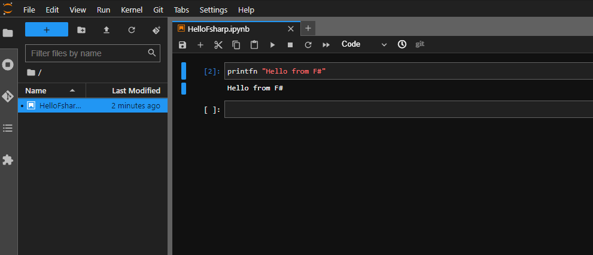

# .NET notebooks with Jupyter on docker-compose

## Build
Docker and docker-compose are required.

```
git clone https://github.com/udemegane/fsharp-jupyterlab-container.git
docker-compose up
```

By default, jupyter starts on port 8080.  



## TODO
 - [ ] Setting Auto Complete

